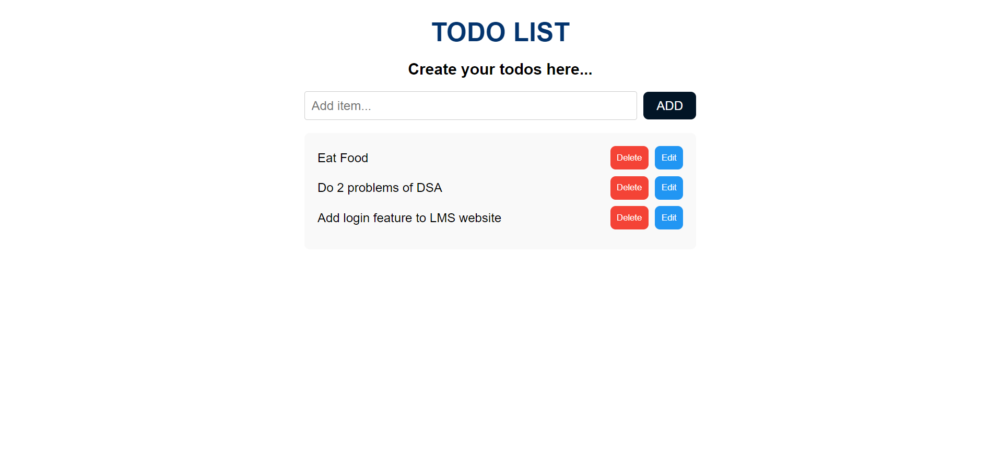

# Todo App

This is a simple Todo App built using Next.js with server-side rendering.



## Live Demo
You can view the live application here: [Live Demo](https://todo-app-ks.netlify.app/)

## Features

- Add new todos
- Delete todos
- View all todos
- Server-side rendering

## Tech Stack

- **Next.js**: A React framework with hybrid static & server rendering, and route pre-fetching.
- **React.js**: A JavaScript library for building user interfaces.
- **CSS**: For styling the application.

## Getting Started

These instructions will get you a copy of the project up and running on your local machine for development and testing purposes.

### Prerequisites

You need to have Node.js and npm installed on your system. You can download them from [here](https://nodejs.org/).

### Installation

1. Clone the repository:

    ```bash
    git clone https://github.com/kushalkumar-shaw/todo-app
    ```

2. Change directory to the project folder:

    ```bash
    cd todo-app
    ```

3. Install the dependencies:

    ```bash
    npm install
    ```

### Running the App

1. Start the development server:

    ```bash
    npm run dev
    ```

2. Open your browser and navigate to `http://localhost:3000`.

### Building for Production

To build the app for production, run:

```bash
npm run build
```

This will create an optimized production build of your application in the .next folder.

